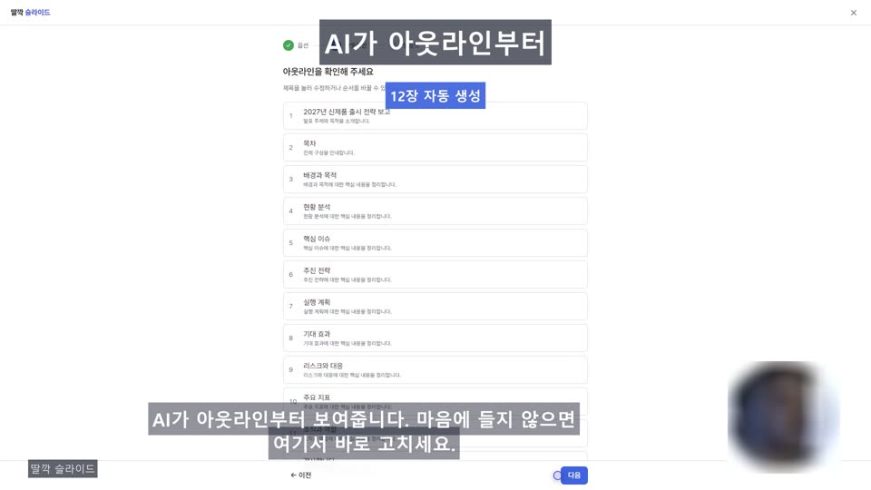
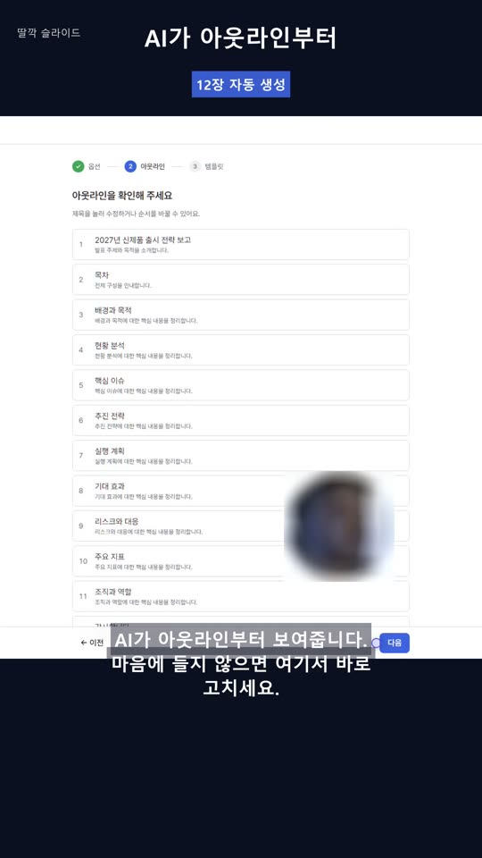

# 예제 — 딸깍 슬라이드 홍보영상

**한 번 촬영해 변형 5종.** 아래 숫자는 전부 실제 산출물에서 잰 값이다 (2026-08-02, `tools/ad-video/`).
대본은 [ttalkak-slide-promo.scenes.json](ttalkak-slide-promo.scenes.json).

템플릿(`../templates/scenes.promo.json`)은 **골격**을 준다. 이 문서는 그 골격을 실제로 돌렸을 때
**무슨 값이 나오고 무엇이 어긋났는지**를 준다. 둘 다 보고 시작하는 편이 빠르다.

## 나온 것

| 변형 | 쓴 씬 | 길이 | 해상도 | 특징 |
|---|---|---|---|---|
| `ad-30s-16x9` | s1~s6 전체 | 36.97초 | 1920×1080 | 인스트림 스킵형 |
| `ad-15s-16x9` | s1·s2·s6 | 19.87초 | 1920×1080 | 논스킵·범퍼용 축약 |
| `shorts-9x16` | s1~s6 전체 | 36.97초 | 1080×1920 | 세로 |
| `hybrid-30s-16x9` | s2·s4·s5 + 모션 3개 | 29.13초 | 1920×1080 | 도입·수치·마무리를 모션으로 |
| `hybrid-clean-30s-16x9` | 위와 같음 | 29.13초 | 1920×1080 | 헤드라인·인물 없이 화면만 (촬영 당시엔 자막도 껐지만, 지금은 자막을 끌 수 없다) |

촬영은 한 번(`take.webm` 2.4MB, 34.1초 — 리드인 2.1초 포함)이고 나머지는 전부 합성 단계에서 갈렸다.
완성본은 3.5MB 안팎 — 대본을 고쳐도 `--only compose`면 몇십 초다.

## 길이는 대본이 정한다 — "15초 버전"이 19.9초인 이유

씬 길이 = `max(내레이션 + hold, 조작에 걸린 시간)`. 이 촬영에서는 `timeline.json`의 6씬이 전부
`overran: false`였다 — **조작이 아니라 음성이 길이를 정했다**는 뜻이다.

```
s1 4.58  s2 4.22  s3 3.87  s4 7.19  s5 6.04  s6 5.48   합계 31.37초
ad-30s = 31.37 + 인트로 2.4 + 엔드카드 3.2 = 36.97   (실측 36.97)
ad-15s = (4.58 + 4.22 + 5.48) + 2.4 + 3.2   = 19.87   (실측 19.87)
```

씬을 빼는 것만으로는 15초에 못 간다. **문장을 줄여야 한다.** 초를 맞춰야 하는 납품이면
대본 단계에서 `--only tts`로 길이부터 재고 문장을 다듬는다.

## 약한 씬은 모션으로 갈아 끼운다

s1(랜딩)과 s6(가격표)은 **제품이 일하는 화면이 아니다** — 그냥 페이지다. `hybrid` 변형은 그 둘을
빼고 같은 문장을 모션 카드가 읽게 했다. 남은 s2·s4·s5는 입력·생성·결과, 즉 실제로 뭔가 일어나는 씬뿐이다.

모션 클립에 `"variants": [...]`를 걸면 **같은 촬영본에서 구성이 다른 변형**이 나온다.

```json
{ "id": "h-intro", "file": "intro.html", "before": "s2",
  "narration": "발표 자료 하나 만드는 데 반나절씩 쓰고 계신가요?",
  "variants": ["hybrid-30s-16x9", "hybrid-clean-30s-16x9"] }
```

이 문장은 s1의 내레이션과 **한 글자도 다르지 않다.** 그래서 `out/audio/manifest.json`에서
`s1`과 `motion-h-intro`의 해시가 같고(`541366944a14`), TTS를 다시 부르지 않는다.
문장을 재사용하면 음성도 재사용된다.

## 화면에 얹은 것 — 실제로 이렇게 보인다

같은 시각(s4 + 1.2초)을 두 변형에서 뽑은 프레임이다. 인물 PiP는 개인 소재라 가렸다 — **위치와 크기만** 보면 된다.

### 16:9 — 헤드라인이 앱을 가린 사례



- **상단 헤드라인(`caption`)이 스텝 인디케이터를 덮었다.** 게다가 하단 자막에 같은 문장이 이미 있어
  정보도 중복이다. SKILL.md가 "홍보 16:9는 `captions: false`"라고 한 게 이 현상이다 —
  `hybrid` 두 변형은 껐고, 이 `ad-30s`는 켜 둔 채로 남아 있다. **켜 두면 이렇게 된다.**
- **자막이 하단 "다음" 버튼에 걸린다.** 조작 버튼이 하단에 있는 화면은 자막이 필연적으로 겹친다.
  자막을 올리거나(`subtitleMargin`) 그 씬에서 버튼을 안 보이게 스크롤한다.
- 뱃지("12장 자동 생성")는 헤드라인 바로 아래. 16:9·9:16 어느 쪽에서도 유튜브 UI와 안 겹치는 자리다.

### 9:16 — 같은 문구가 안 가리는 이유



- `crop: "960:1080:480:0"`으로 가운데를 떼고 `padY: 260`으로 위에 붙였다. 위아래 남는 띠가 `background`(#0B1020).
- **헤드라인·뱃지가 그 띠 안에 들어가 앱 화면을 전혀 안 가린다** — 16:9와 정반대 결과다.
  세로에서만 `caption`을 살리는 이유가 이것이다.
- 워터마크는 기본 자리(우상)에 두되 `watermarkMargin: 0.075`로 내렸다 — 상단 유튜브 UI(약 90px)를
  피하기 위해서다. (촬영 당시에는 좌상 `watermarkAlign: 7`로 피했는데, 지금은 기본이 우상이고
  판 없이 그려져 아래로 내리는 편이 낫다.)
- 자막은 `subtitleMargin: 0.185` — 하단 안전영역(약 330px) 위에 앉는다.

## 실측 조정값 — 베끼지 말고 출발점으로

| 항목 | 값 | 왜 |
|---|---|---|
| 인물 PiP | `zoom 0.6` `focusX 0.4` `focusY 0.05` | 기본 가운데 크롭이면 원 안이 책상·가슴으로 찬다. 얼굴은 화면 위쪽에 있다 |
| 목소리 | `ko-KR-SunHiNeural`, `rate +8%` | 기본 속도는 광고에 느리다 |
| 자막 글꼴 | `Malgun Gothic` | **시스템에 설치된 글꼴만** 된다. Pretendard는 woff2라 못 쓴다 |
| 모션 글꼴 | `params.fontUrl` → 프로젝트 woff2 | 모션은 브라우저 렌더라 웹폰트가 그대로 된다. **같은 영상에서 글꼴 경로가 둘로 갈린다** |
| BGM | `mixkit-132.mp3`, `gain 0.18`, `ducking true` | 일정 볼륨으로 깔면 말과 같은 대역에서 싸운다 |

## 셀렉터 — `optional`을 어디 붙였나

| 붙이지 않음 | 붙임 |
|---|---|
| `goto` · `wait` · `type: "#topic"` | `click: "button:has-text('아웃라인 만들기')"` |
| 라우트와 id는 저장소에서 눈으로 확인했다 | `waitFor: "text=아웃라인을 확인해 주세요"` (`timeout: 25`) |
| | `waitFor: "h2:has-text('Pro')"` (`timeout: 8`) |
| | **백엔드·AI 응답에 걸려 있어 환경에 따라 안 뜬다** |

s4의 `timeout: 25`는 AI 생성 대기라 길게 잡았다. `optional`이 없으면 실패할 때 그 시간을 통째로 먹고
영상에 로딩 화면이 25초 찍힌다.

## 뱃지 문구는 근거가 있어야 한다

- `"12장 자동 생성"` — 실제로 아웃라인 12행이 찍혔다. 프레임에서 셀 수 있다.
- `"가입 시 120크레딧"` — 요금제에 정의된 값.

둘 다 저장소에서 확인한 수치다. **확인할 수 없는 숫자는 뱃지에 올리지 않는다.**

## 옮겨 쓸 때 고칠 것

1. `baseUrl` — 이 대본은 `http://localhost:5173`(Vite 기본)
2. `render.bgm` — 영상 작업 폴더 기준 상대 경로
3. `motion.clips[].params.fontUrl` — 이 프로젝트의 웹폰트 위치라 그대로 두면 글꼴이 안 붙는다
4. 셀렉터 전부 — `#topic`, `button:has-text('아웃라인 만들기')`는 이 앱의 것이다
5. `variants[].crop` — 1920×1080 기준. 촬영 해상도가 다르면 다시 계산한다
